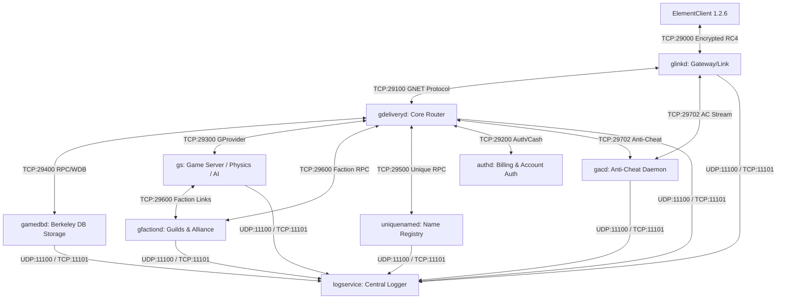

# Especificação Técnica Master de Engenharia Reversa: Perfect World v1.2.6 (v55)

Este documento é a referência técnica exaustiva de engenharia reversa para o servidor e cliente do **Perfect World versão 1.2.6 (build v55 / server_code: 66054 / client v1.2.6)**, construído com base na análise estática e dinâmica direta dos binários compilados (Linux ELF x86: `gs`, `gdeliveryd`, `gamedbd`, `glinkd`, `gfactiond`, `uniquenamed`, `gacd`, `logservice`, e Java `authd`) e nas árvores de código-fonte C++ oficial da engine Angelica 3D / Wanmei Network Framework (`source_server_153` e `source_client_153`).

---

## 1. Arquitetura Geral e Matriz de Comunicação dos Daemons

O ecossistema do servidor Perfect World v1.2.6 é composto por 9 daemons especializados desacoplados que comunicam-se via TCP/UDP sobre o framework proprietário GNET (Goldman Network Library):



### 1.1 Tabela de Portas, Protocolos e Funções de Cada Daemon

| Daemon | Binário ELF | Porta Padrão | Protocolo / Papel | Dependências |
| :--- | :--- | :--- | :--- | :--- |
| **`glinkd`** | `glinkd` (2.8 MB) | `29000` (Client), `29100` (Delivery) | Gateway de entrada dos jogadores, multiplexador de conexões, handshake criptográfico (RC4/MD5), compressão CUint e filtro de pacotes. | `gdeliveryd`, `gacd` |
| **`gdeliveryd`** | `gdeliveryd` (45.1 MB) | `29100` (Link), `29300` (Provider GS), `29200` (Auth) | Servidor central de roteamento, controle de sessões, login, seleção de personagens, chat global/whisper/party, leilão, correio, loja Gold. | `gamedbd`, `authd`, `uniquenamed`, `gfactiond`, `gacd` |
| **`gamedbd`** | `gamedbd` (3.1 MB) | `29400` (TCP RPC) | Servidor de persistência baseado em Berkeley DB (WDB StorageEnv), manipula 24 tabelas relacionais de personagens, inventário, guildas e economia. | Local BDB storage |
| **`gs` (gamed)** | `gs` (12.3 MB) + `libtask.so` | Conecta em `29300` e `29600` | Motor de física 3D, IA de monstros, combate, cálculo de dano, árvore de missões (`tasks.data`), colisão (`.rmap`), água (`.wmap`), instâncias e mapas abertos. | `gdeliveryd`, `gfactiond`, arquivos `.data` |
| **`gfactiond`** | `gfactiond` (1.3 MB) | `29600` (TCP RPC) | Gerenciamento de clãs, hierarquia de membros, proclamações, alianças, rivalidades e controle da Guerra Territorial (Territory War). | `gdeliveryd`, `gamedbd` |
| **`uniquenamed`**| `uniquenamed` (1.7 MB) | `29500` (TCP RPC) | Registro atômico e garantia de unicidade de nomes de personagens (`unamerole`), nomes de facções (`unamefaction`) e alocação de IDs sequenciais. | Local BDB storage |
| **`authd`** | `authd.class` (Java JVM) | `29200` (TCP) | Validação de credenciais de contas, faturamento de Gold/Cash (`AddCash`, `UseCash`), controle de privilégios GM e anti-wallow/fadiga. | MySQL / Local Auth DB |
| **`gacd`** | `gacd` (1.8 MB) | `29702` (TCP), `29712` (Control) | Motor anti-cheat do lado servidor, inspeção de integridade de memória, checagem de velocidade/speedhack e injeção de bytecodes de verificação. | `glinkd`, `gdeliveryd` |
| **`logservice`** | `logservice` (433 KB) | `11100` (UDP), `11101` (TCP) | Servidor de agregação de logs (`world2.log`, `world2.formatlog`, `world2.chat`, `world2.cash`, `world2.err`, estatísticas horárias/diárias). | Sistema de arquivos de log |

---

## 2. Camada de Transporte, Enquadramento e Codificação (GNET Protocol)

### 2.1 Enquadramento do Frame TCP (Packet Framing)
Toda mensagem transmitida sobre conexões GNET segue o enquadramento de baixo nível:

```
+-------------------+--------------------+----------------------------------------+
| Opcode (CUint)    | Length (CUint)     | Payload Serializado (Length bytes)     |
+-------------------+--------------------+----------------------------------------+
```

### 2.2 Algoritmo Compact-UInt (CUint)
O CUint comprime inteiros de 32 bits sem sinal com base nos bits mais significativos do primeiro byte:
- **0x00 .. 0x7F (0 .. 127)**: 1 byte (`[b0]`)
- **0x80 .. 0x3FFF (128 .. 16.383)**: 2 bytes (`[b0 | 0x80, b1]` -> `value = ((b0 & 0x3F) << 8) | b1`)
- **0x4000 .. 0x1FFFFFFF (16.384 .. 536.870.911)**: 4 bytes (`[b0 | 0xC0, b1, b2, b3]` -> `value = ((b0 & 0x1F) << 24) | (b1 << 16) | (b2 << 8) | b3`)
- **>= 0x20000000**: 5 bytes (`[0xE0, b1, b2, b3, b4]` -> `b1..b4` como `u32 Big-Endian`)

### 2.3 Regras de Endianness e Primitivos
1. **Cabeçalhos de Protocolo GNET, RPC IDs e Contagens de Vetor**: Serializados em **Big-Endian / CUint**.
2. **Subcomandos Internos do Mundo 3D (GAMEDATASEND - 0x20 / 0x22)**: Serializados estritamente em **Little-Endian** em todos os campos numéricos, floats e structs.
3. **Strings**:
   - Nomes de personagens, mensagens de chat e títulos: codificados em **UTF-16LE** com prefixo de tamanho em bytes (`CUint` ou `u16` de acordo com o contexto).
   - Nomes de contas, strings internas e identificadores: codificados em **UTF-8** ou **ASCII/GBK** encapsulados em `Octets` (comprimento em `CUint` + bytes).
4. **Octets**: `[Length: CUint] [Data: u8 * Length]`.
5. **Vector / RpcDataVector<T>**: `[Count: CUint] [Element_0: T] [Element_1: T] ... [Element_N: T]`.

---

## 3. Catálogo Completo de Protocolos GNET v1.2.6 (Opcodes de Alto Nível)

Abaixo está o mapeamento exaustivo dos **214 Protocolos Oficiais** extraídos diretamente da tabela de símbolos e decompilação dos binários da versão 1.2.6:

### 3.1 Autenticação, Gateway e Sessão (Client <-> glinkd <-> gdeliveryd <-> authd)

| Opcode (Dec) | Opcode (Hex) | Nome do Protocolo | Daemons | Estrutura dos Campos Serializados |
| :--- | :--- | :--- | :--- | :--- |
| **1** | `0x0001` | `Challenge` | `glinkd` | `nonce: Octets (16B)`, `version: u32`, `algo: i8` |
| **2** | `0x0002` | `Response` | `glinkd` | `identity: Octets (username UTF-8)`, `response: Octets (MD5 16B)`, `use_encryption: u8` |
| **3** | `0x0003` | `KeyExchange` | `gdeliveryd, glinkd` | `nonce: Octets (16B RC4 key)`, `force_flag: i8` |
| **4** | `0x0004` | `OnlineAnnounce` | `gdeliveryd, glinkd` | `userid: i32`, `localsid: u32`, `remain_time: i32`, `zoneid: i8`, `free_time_left: i32`, `free_time_end: i32`, `creatime: i32` |
| **5** | `0x0005` | `ErrorInfo` | `glinkd` | `errcode: u8`, `info: Octets` |
| **6** | `0x0006` | `StatusAnnounce` | `gdeliveryd, glinkd` | `userid: i32`, `localsid: u32`, `status: u8` |
| **7** | `0x0007` | `RoleStatusAnnounce`| `gdeliveryd, glinkd` | `type: i8`, `userid: i32`, `localsid: u32`, `status: u8`, `auth: Octets` |
| **10** | `0x000A` | `KickoutUser` | `gdeliveryd, glinkd` | `userid: i32`, `localsid: u32`, `cause: u8` |
| **34** | `0x0022` | `GamedataSend` | `glinkd` | `data: Octets` (Payload binário de subcomandos Little-Endian) |
| **35** | `0x0023` | `ReportIP` | `gdeliveryd, glinkd` | `userid: i32`, `ip: i32` |
| **36** | `0x0024` | `UpdateRemainTime` | `gdeliveryd, glinkd` | `userid: i32`, `remain_time: i32`, `free_time_left: i32`, `free_time_end: i32`, `creatime: i32` |

---

### 3.2 Gestão de Personagens e Seleção (gdeliveryd <-> glinkd <-> Client)

| Opcode (Dec) | Opcode (Hex) | Nome do Protocolo | Daemons | Estrutura dos Campos Serializados |
| :--- | :--- | :--- | :--- | :--- |
| **70** | `0x0046` | `SelectRole` | `gdeliveryd, glinkd` | `roleid: i32`, `flag: u8` |
| **71** | `0x0047` | `SelectRole_Re` | `gdeliveryd, glinkd` | `result: i32`, `auth: Octets (Token de Sessão)` |
| **82** | `0x0052` | `RoleList` | `gdeliveryd, glinkd` | `userid: i32`, `localsid: u32`, `handle: i32` |
| **83** | `0x0053` | `RoleList_Re` | `gdeliveryd, glinkd` | `result: i32`, `handle: i32`, `userid: i32`, `localsid: u32`, `rolelist: vector<RoleInfo>` |
| **84** | `0x0054` | `CreateRole` | `gdeliveryd, glinkd` | `userid: i32`, `localsid: u32`, `roleinfo: RoleInfo` |
| **85** | `0x0055` | `CreateRole_Re` | `gdeliveryd, glinkd` | `result: i32`, `roleid: i32`, `localsid: u32`, `roleinfo: RoleInfo` |
| **86** | `0x0056` | `DeleteRole` | `gdeliveryd, glinkd` | `roleid: i32`, `localsid: u32` |
| **87** | `0x0057` | `DeleteRole_Re` | `gdeliveryd, glinkd` | `result: i32`, `roleid: i32`, `localsid: u32` |
| **88** | `0x0058` | `UndoDeleteRole` | `gdeliveryd, glinkd` | `roleid: i32`, `localsid: u32` |
| **89** | `0x0059` | `UndoDeleteRole_Re` | `gdeliveryd, glinkd`| `result: i32`, `roleid: i32`, `localsid: u32` |

---

### 3.3 Chat, Social, Amigos e Correio (gdeliveryd <-> glinkd <-> gs)

| Opcode (Dec) | Opcode (Hex) | Nome do Protocolo | Daemons | Estrutura dos Campos Serializados |
| :--- | :--- | :--- | :--- | :--- |
| **80** | `0x0050` | `ChatMessage` | `gdeliveryd, glinkd, gs` | `channel: u8`, `emotion: u8`, `srcroleid: i32`, `msg: Octets (UTF-16LE)`, `data: Octets` |
| **96** | `0x0060` | `PublicChat` | `gdeliveryd, glinkd, gs` | `channel: u8`, `emotion: u8`, `srcroleid: i32`, `msg: Octets (UTF-16LE)`, `data: Octets` |
| **97** | `0x0061` | `PrivateChat` | `gdeliveryd, glinkd` | `channel: u8`, `emotion: u8`, `srcroleid: i32`, `dstroleid: i32`, `msg: Octets (UTF-16LE)`, `data: Octets` |
| **100** | `0x0064` | `GetFriendList` | `gdeliveryd, glinkd` | `roleid: i32`, `localsid: u32` |
| **101** | `0x0065` | `GetFriendList_Re` | `gdeliveryd, glinkd` | `result: i32`, `roleid: i32`, `localsid: u32`, `friends: vector<GFriendInfo>` |
| **102** | `0x0066` | `AddFriend` | `gdeliveryd, glinkd` | `roleid: i32`, `localsid: u32`, `friend_roleid: i32`, `group_id: u8` |
| **103** | `0x0067` | `AddFriend_Re` | `gdeliveryd, glinkd` | `result: i32`, `roleid: i32`, `localsid: u32`, `friend_info: GFriendInfo` |
| **104** | `0x0068` | `DelFriend` | `gdeliveryd, glinkd` | `roleid: i32`, `localsid: u32`, `friend_roleid: i32` |
| **110** | `0x006E` | `SendMail` | `gdeliveryd, glinkd, gs` | `src_roleid: i32`, `localsid: u32`, `dst_name: Octets (UTF-16LE)`, `title: Octets`, `context: Octets`, `attach_obj: GMailAttachObj` |
| **111** | `0x006F` | `SendMail_Re` | `gdeliveryd, glinkd` | `result: i32`, `src_roleid: i32`, `localsid: u32` |
| **112** | `0x0070` | `GetMailList` | `gdeliveryd, glinkd` | `roleid: i32`, `localsid: u32` |
| **113** | `0x0071` | `GetMailList_Re` | `gdeliveryd, glinkd` | `result: i32`, `roleid: i32`, `localsid: u32`, `maillist: vector<GMailHeader>` |
| **114** | `0x0072` | `GetMail` | `gdeliveryd, glinkd` | `roleid: i32`, `localsid: u32`, `mail_id: u8` |
| **115** | `0x0073` | `GetMail_Re` | `gdeliveryd, glinkd` | `result: i32`, `roleid: i32`, `localsid: u32`, `mail: GMail` |
| **116** | `0x0074` | `GetMailAttach` | `gdeliveryd, glinkd` | `roleid: i32`, `localsid: u32`, `mail_id: u8` |
| **117** | `0x0075` | `GetMailAttach_Re` | `gdeliveryd, glinkd` | `result: i32`, `roleid: i32`, `localsid: u32`, `mail_id: u8`, `attach: GMailAttachObj` |

---

### 3.4 Casa de Leilões e Mercado de Ações (Auction & Stock Exchange)

| Opcode (Dec) | Opcode (Hex) | Nome do Protocolo | Daemons | Estrutura dos Campos Serializados |
| :--- | :--- | :--- | :--- | :--- |
| **130** | `0x0082` | `AuctionOpen` | `gdeliveryd, glinkd, gs` | `roleid: i32`, `localsid: u32`, `item_id: i32`, `count: u32`, `base_price: u32`, `bin_price: u32`, `duration: u32` |
| **131** | `0x0083` | `AuctionOpen_Re` | `gdeliveryd, glinkd` | `result: i32`, `roleid: i32`, `localsid: u32`, `auction_id: u32` |
| **132** | `0x0084` | `AuctionBid` | `gdeliveryd, glinkd, gs` | `roleid: i32`, `localsid: u32`, `auction_id: u32`, `bid_price: u32` |
| **133** | `0x0085` | `AuctionBid_Re` | `gdeliveryd, glinkd` | `result: i32`, `roleid: i32`, `localsid: u32`, `auction_id: u32` |
| **134** | `0x0086` | `AuctionList` | `gdeliveryd, glinkd` | `roleid: i32`, `localsid: u32`, `category: u16`, `item_id: i32`, `page: u16` |
| **135** | `0x0087` | `AuctionList_Re` | `gdeliveryd, glinkd` | `result: i32`, `roleid: i32`, `localsid: u32`, `total: u32`, `items: vector<AuctionDetail>` |
| **140** | `0x008C` | `StockCommission` | `gdeliveryd, glinkd` | `roleid: i32`, `localsid: u32`, `op_type: u8 (1=Buy, 2=Sell)`, `cash: u32`, `price: u32` |
| **141** | `0x008D` | `StockCommission_Re` | `gdeliveryd, glinkd`| `result: i32`, `roleid: i32`, `localsid: u32`, `order_id: u32` |
| **142** | `0x008E` | `StockCancel` | `gdeliveryd, glinkd` | `roleid: i32`, `localsid: u32`, `order_id: u32` |
| **143** | `0x008F` | `StockCancel_Re` | `gdeliveryd, glinkd` | `result: i32`, `roleid: i32`, `localsid: u32` |

---

### 3.5 Interface com gs (GProviderServer: gs <-> gdeliveryd)

| Opcode (Dec) | Opcode (Hex) | Nome do Protocolo | Daemons | Estrutura dos Campos Serializados |
| :--- | :--- | :--- | :--- | :--- |
| **500** | `0x01F4` | `PlayerLogin` | `gdeliveryd, gs` | `roleid: i32`, `link_id: i32`, `localsid: u32`, `status: u8` |
| **501** | `0x01F5` | `PlayerLogout` | `gdeliveryd, gs` | `roleid: i32`, `result: i32` |
| **502** | `0x01F6` | `PlayerEnterWorld` | `gdeliveryd, gs` | `roleid: i32`, `world_tag: i32`, `pos: Vector3`, `auth_token: Octets` |
| **503** | `0x01F7` | `PlayerLeaveWorld` | `gdeliveryd, gs` | `roleid: i32`, `reason: i32` |
| **504** | `0x01F8` | `SyncPlayerStatus` | `gdeliveryd, gs` | `roleid: i32`, `level: i16`, `cultivation: i8`, `hp: i32`, `mp: i32`, `world_id: i32`, `pos: Vector3` |
| **505** | `0x01F9` | `TradeStart` | `gdeliveryd, gs` | `roleid1: i32`, `roleid2: i32`, `localid1: i32`, `localid2: i32` |
| **506** | `0x01FA` | `TradeEnd` | `gdeliveryd, gs` | `trade_id: i32`, `role1: i32`, `role2: i32`, `reason: i32` |

---

## 4. Catálogo Completo de RPCs v1.2.6 (gamedbd / uniquenamed / gfactiond)

Abaixo estão as **102 Chamadas de Procedimento Remoto (RPCs)** do servidor 1.2.6 com os layouts exatos de seus argumentos (`Arg`) e resultados (`Res`):

### 4.1 RPCs de Persistência do Jogador e Usuário (`gamedbd`)

#### 1. `GetUser` (RPC 3001 / 0x0BB9)
- **Arg (`UserID`)**: `userid: i32`
- **Res (`UserRes`)**: `retcode: i32`, `value: User`
  - *Campos de `User` v1.2.6*:
    ```
    [logicuid: u32]
    [rolelist: u32]              (Bitmask de 16 slots de personagem)
    [cash: i32]                  (Saldo atual de Gold na loja)
    [money: i32]                 (Saldo no banco)
    [cash_add: u32]              (Total histórico de Gold adicionado)
    [cash_buy: u32]              (Total de compras)
    [cash_sell: u32]             (Total de vendas)
    [cash_used: u32]             (Total consumido)
    [add_serial: i32]
    [use_serial: i32]
    [exg_log: vector<StockLog>]  (Histórico de transações de moedas/Gold)
    [addiction: Octets]          (Dados do sistema anti-vício/fadiga)
    [cash_password: Octets]      (Senha do cofre/banco MD5)
    [status: i16]
    [reserved1: i32]
    [reserved2: i32]
    [reserved3: i32]
    ```

#### 2. `PutUser` (RPC 3002 / 0x0BBA)
- **Arg (`UserPair`)**: `key: UserID (userid: i32)`, `value: User`
- **Res (`UserRes`)**: `retcode: i32` (`0` = Sucesso)

#### 3. `GetRole` (RPC 3003 / 0x0BBB)
- **Arg (`RoleId`)**: `id: i32`
- **Res (`RoleRes`)**: `retcode: i32`, `value: GRoleData`
  - *Composição de `GRoleData` v1.2.6*:
    ```
    [base: GRoleBase]
    [status: GRoleStatus]
    [pocket: GRolePocket]
    [equipment: GRoleEquipment]
    [storehouse: GRoleStorehouse]
    [task: GRoleTask]
    ```

#### 4. `PutRole` (RPC 3004 / 0x0BBC)
- **Arg (`RolePair`)**: `key: RoleId (id: i32)`, `value: GRoleData`, `overwrite: bool`
- **Res (`RoleRes`)**: `retcode: i32`

---

### 4.2 Estruturas de Dados Relacionais do Personagem (gamedbd Storage)

#### `GRoleBase` (Tabela `base`):
```
[version: u8 = 1]
[id: i32]
[name: Octets]                  (Nome UTF-16LE)
[race: i32]                     (0=Humano, 1=Alado, 2=Selvagem)
[cls: i32]                      (0=Guerreiro, 1=Mago, 2=Espiritualista, 3=Feiticeira, 4=Bárbaro, 5=Mercenário, 6=Arqueiro, 7=Sacerdote)
[gender: u8]                    (0=Masculino, 1=Feminino)
[custom_data: Octets]           (Customização facial de nascimento)
[config_data: Octets]           (Atalhos e configurações de UI)
[custom_stamp: u32]
[status: u8]                    (1=Normal, 2=Deletando)
[delete_time: i32]
[create_time: i32]
[lastlogin_time: i32]
[forbid: vector<GRoleForbid>]   (Punições/Bans ativos: [type: u8, time: i32, createtime: i32, reason: Octets])
[help_states: Octets]
[spouse: i32]                   (ID do cônjuge / casamento)
[reserved1: i32]
[reserved2: i32]
```

#### `GRoleStatus` (Tabela `status`):
```
[version: u8 = 1]
[level: i32]
[level2: i32]                   (Cultivo/Nobreza)
[exp: i32]
[sp: i32]
[pp: i32]                       (Pontos de Atributo Livres)
[hp: i32]
[mp: i32]
[posx: f32]
[posy: f32]
[posz: f32]
[worldtag: i32]                 (ID do mapa: 1=Mundo Aberto, instâncias 2..100)
[invader_state: i32]            (Status PK: 0=Branco, 1=Rosa, 2=Vermelho)
[invader_time: i32]
[pariah_time: i32]
[skills: Octets]                (Array de skills: [skill_id: u16, level: u8, ability: u16])
[cooling_time: Octets]          (Tempos de recarga: [id: u16, expire: u32])
[npcrelation: Octets]
[factioncontrib: Octets]
[force_data: Octets]
[title_data: Octets]
[storehousepasswd: Octets]      (Senha do banqueiro MD5)
[waypointlist: Octets]          (Teleportes desbloqueados bitmask)
[coolingtime: Octets]
```

#### `GRoleInventory` / `GRolePocket` (Tabela `inventory`):
```
[capacity: u32]                 (Slots liberados: 32 a 64)
[timestamp: i32]
[money: u32]                    (Moedas na bolsa)
[items: vector<GRoleInventory>]
  Para cada item:
    [id: u32]                   (Template ID no elements.data)
    [pos: u32]                  (Slot index: 0..63)
    [count: u32]                (Quantidade empilhada)
    [max_count: u32]
    [data: Octets]              (Essence binária: durabilidade, slots, pedras, add-ons)
    [proctype: u32]             (Flags de vinculação / troca)
    [expire_date: i32]          (Timestamp unix de expiração ou 0)
    [guid1: u32]
    [guid2: u32]
    [mask: u32]
```

#### `GRoleEquipment` (Tabela `equipment`):
```
[inv: vector<GRoleInventory>]   (Slots fixos de armadura, arma, anéis, amuleto, capa, elmo, voo, moda)
```

#### `GRoleStorehouse` (Tabela `storehouse`):
```
[capacity: u32]                 (Capacidade do banqueiro normal: 16..80)
[money: u32]                    (Moedas guardadas no banco)
[items: vector<GRoleInventory>]
[dress_capacity: u32]           (Guarda-roupa de moda)
[dress_items: vector<GRoleInventory>]
[material_capacity: u32]        (Banco de materiais)
[material_items: vector<GRoleInventory>]
```

#### `GRoleTask` (Tabela `task`):
```
[task_data: Octets]             (Buffer binário de missões ativas)
[task_complete: Octets]         (Buffer binário de missões concluídas com timestamp)
[task_finishtime: Octets]
```

---

### 4.3 RPCs de Registro Único de Nomes (`uniquenamed`)

1. **`PreCreateRole` (RPC 3101 / 0x0C1D)**:
   - **Arg (`PreCreateRoleArg`)**: `roleid: i32`, `rolename: Octets (UTF-16LE)`
   - **Res (`PreCreateRoleRes`)**: `retcode: i32` (`0` = Nome disponível e bloqueado temporariamente por 30s)
2. **`PostCreateRole` (RPC 3102 / 0x0C1E)**:
   - **Arg (`PostCreateRoleArg`)**: `roleid: i32`, `userid: i32`, `rolename: Octets`
   - **Res (`PostCreateRoleRes`)**: `retcode: i32` (`0` = Nome gravado definitivamente em `unamerole` e `uidrole`)
3. **`PostDeleteRole` (RPC 3103 / 0x0C1F)**:
   - **Arg (`PostDeleteRoleArg`)**: `roleid: i32`, `rolename: Octets`
   - **Res (`PostDeleteRoleRes`)**: `retcode: i32` (`0` = Nome liberado)
4. **`PreCreateFaction` (RPC 3111 / 0x0C27)**:
   - **Arg (`PreCreateFactionArg`)**: `fid: i32`, `name: Octets`
   - **Res (`PreCreateFactionRes`)**: `retcode: i32`
5. **`PostCreateFaction` (RPC 3112 / 0x0C28)**:
   - **Arg (`PostCreateFactionArg`)**: `fid: i32`, `name: Octets`, `master: i32`
   - **Res (`PostCreateFactionRes`)**: `retcode: i32`

---

## 5. Protocolo de Gameplay Mundo 3D (GAMEDATASEND - 0x20 / 0x22)

Os pacotes de gameplay do mundo trafegam envelopados no opcode de alto nível `0x20` (C2S) e `0x22` (S2C), contendo subcomandos serializados em **Little-Endian**:
`[sub_cmd: u16 (Little-Endian)]` + `[Payload da struct]`.

### 5.1 Tabela Completa de Subcomandos S2C (Servidor -> Cliente)

| Subcomando ID | Nome Simbólico | Layout Exato dos Campos Serializados |
| :--- | :--- | :--- |
| **0** | `PLAYER_INFO_1` | `cid: i32`, `pos: Vector3 (12B)`, `crc: u16`, `custom_crc: u16`, `dir: u8`, `sec_level: u8`, `state: u32`, `[ExtendState]` |
| **1** | `PLAYER_INFO_2` | `cid: i32`, `name_len: u8`, `name: [u16; name_len/2]`, `custom_data: Octets` |
| **2** | `PLAYER_INFO_3` | `cid: i32`, `count: u8`, `equip_views: [slot: u8, item_id: i32, addon_count: u8]` |
| **3** | `PLAYER_INFO_4` | `cid: i32`, `size: u16`, `detail_buffer: [u8; size]` |
| **4** | `INST_DATA_CHECKOUT` | `id_inst: i32`, `region_ts: u32`, `precinct_ts: u32`, `gshop_ts: u32`, `gshop_ts2: u32` (20B) |
| **8** | `SELF_INFO_1` | `exp: i32`, `sp: i32`, `cid: i32`, `pos: Vector3 (12B)`, `crc: u16`, `custom_crc: u16`, `dir: u8`, `sec_level: u8`, `state: u32`, `[ExtendState]` |
| **9** | `NPC_INFO_LIST` | `count: u16`, vetor de `npc_info` |
| **10**| `MATTER_INFO_LIST` | `count: u16`, vetor de `matter_info_1` |
| **11**| `NPC_ENTER_SLICE` | `nid: i32`, `tid: i32`, `pos: Vector3`, `seed: u16`, `dir: u8`, `state: u32`, `[NPCExtendState]` |
| **12**| `PLAYER_ENTER_SLICE`| `info_1: PLAYER_INFO_1`, `info_2: PLAYER_INFO_2`, `info_3: PLAYER_INFO_3` |
| **13**| `OBJECT_LEAVE_SLICE`| `id: i32` (4B) |
| **14**| `NOTIFY_HOSTPOS` | `pos: Vector3 (12B)`, `dir: u8` (13B) |
| **15**| `OBJECT_MOVE` | `id: i32`, `dest: Vector3 (12B)`, `use_time: u16`, `speed: u16`, `move_mode: u8` (21B) |
| **16**| `NPC_ENTER_WORLD` | `nid: i32`, `tid: i32`, `pos: Vector3`, `seed: u16`, `dir: u8`, `state: u32`, `[NPCExtendState]` |
| **17**| `PLAYER_ENTER_WORLD`| `role_id: i32`, `world_tag: i32`, `pos: Vector3 (12B)` (20B) |
| **18**| `MATTER_ENTER_WORLD`| `mid: i32`, `tid: i32`, `pos: Vector3`, `dir0: u8`, `dir1: u8`, `rad: u8`, `state: u8`, `value: u8` |
| **19**| `PLAYER_LEAVE_WORLD`| `role_id: i32` (4B) |
| **20**| `NPC_DIED` | `nid: i32`, `killer_id: i32` (8B) |
| **21**| `OBJECT_DISAPPEAR` | `id: i32` (4B) |
| **24**| `HOST_ATTACKRESULT` | `target_id: i32`, `damage: i32`, `hit_type: u8` (1=Hit, 2=Crit, 4=Miss, 8=Dodge) (9B) |
| **32**| `PLAYER_INFO_00` | `lvl: i16`, `combat_state: u8`, `sec_level: u8`, `hp: i32`, `max_hp: i32`, `mp: i32`, `max_mp: i32`, `target_id: i32` (24B) |
| **33**| `NPC_INFO_00` | `hp: i32`, `max_hp: i32`, `target_id: i32` (12B) |
| **36**| `RECEIVE_EXP` | `exp: i32`, `sp: i32` (8B) |
| **37**| `LEVEL_UP` | `role_id: i32` (4B) |
| **38**| `SELF_INFO_00` | `lvl: i16`, `combat_state: u8`, `sec_level: u8`, `hp: i32`, `max_hp: i32`, `mp: i32`, `max_mp: i32`, `exp: i32`, `sp: i32`, `ap: i32` (36B) |
| **39**| `UNSELECT` | Vazio (0B) |
| **40**| `OWN_ITEM_INFO` | `package: u8`, `slot: u8`, `tid: i32`, `expire_date: i32`, `state: i32`, `count: u32`, `crc: u16`, `essence_len: u16`, `essence_data: [u8]` |
| **41**| `EMPTY_ITEM_SLOT` | `package: u8`, `slot: u8` (2B) |
| **42**| `OWN_IVTR_DATA` | `package: u8`, `capacity: u8`, `count: u32`, vetor de `[slot: u8, tid: i32, expire: i32, count: u32]` |
| **44**| `EXG_IVTR_ITEM` | `slot1: u8`, `slot2: u8` (2B) |
| **45**| `MOVE_IVTR_ITEM` | `src: u8`, `dest: u8`, `count: u16` (4B) |
| **47**| `EXG_EQUIP_ITEM` | `slot1: u8`, `slot2: u8` (2B) |
| **48**| `EQUIP_ITEM` | `inv_slot: u8`, `equip_slot: u8`, `inv_count: u16`, `equip_count: u16` (6B) |
| **49**| `MOVE_EQUIP_ITEM` | `inv_slot: u8`, `equip_slot: u8`, `count: u16` (4B) |
| **52**| `SELECT_TARGET` | `target_id: i32` (4B) |
| **53**| `PLAYER_EXT_PROP_BASE`| `cid: i32`, `vitality: i32`, `energy: i32`, `strength: i32`, `agility: i32`, `max_hp: i32`, `max_mp: i32`, `hp_gen: i32`, `mp_gen: i32` (36B) |
| **54**| `PLAYER_EXT_PROP_MOVE`| `cid: i32`, `walk_speed: f32`, `run_speed: f32`, `swim_speed: f32`, `flight_speed: f32` (20B) |
| **55**| `PLAYER_EXT_PROP_ATTACK`| `cid: i32`, `phys_dmg_min: i32`, `phys_dmg_max: i32`, `attack_rate: i32`, `crit_rate: i32`, `attack_speed: i32`, `attack_range: f32` (28B) |
| **56**| `PLAYER_EXT_PROP_DEFENSE`| `cid: i32`, `phys_def: i32`, `metal_def: i32`, `wood_def: i32`, `water_def: i32`, `fire_def: i32`, `earth_def: i32`, `evasion: i32` (32B) |
| **70**| `NPC_GREETING` | `nid: i32` (4B) (Abre janela de diálogo do NPC) |
| **85**| `OBJECT_CAST_SKILL` | `caster: i32`, `target: i32`, `skill_id: i32`, `cast_time_ms: u16`, `skill_level: u8` (15B) |
| **86**| `SKILL_INTERRUPTED` | `role_id: i32` (4B) |
| **87**| `SKILL_PERFORM` | `role_id: i32` (4B) |
| **90**| `SKILL_DATA` | `count: u32`, vetor de `[skill_id: u16, level: u8, ability: u16]` |
| **91**| `HOST_USE_ITEM` | `package: u8`, `slot: u8`, `item_id: i32`, `count: u16` (8B) |
| **105**| `TASK_DATA` | `active_len: u32`, `active_buf: [u8]`, `finish_len: u32`, `finish_buf: [u8]`, `time_len: u32`, `time_buf: [u8]` |
| **106**| `TASK_VAR_DATA` | `size: u32`, `reason: u8`, `payload: struct task_notify` (Layout detalhado na Seção 5.3) |
| **111**| `OBJECT_SIT_DOWN` | `role_id: i32` (4B) |
| **112**| `OBJECT_STAND_UP` | `role_id: i32` (4B) |
| **113**| `OBJECT_DO_EMOTE` | `role_id: i32`, `emotion: u16` (6B) |
| **120**| `TEAM_LEADER_INVITE`| `inviter_id: i32` (4B) |
| **121**| `TEAM_REJECT_INVITE`| `rejecter_id: i32` (4B) |
| **122**| `TEAM_JOIN_PARTY` | `member_id: i32`, `leader_id: i32` (8B) |
| **123**| `TEAM_LEAVE_PARTY` | `member_id: i32`, `reason: i32` (8B) |
| **124**| `TEAM_MEMBER_DATA` | `count: u8`, vetor de `[id: i32, lvl: i16, hp: i32, max_hp: i32, mp: i32, max_mp: i32, pos: Vector3]` |
| **181**| `PLAYER_WAYPOINT_LIST`| `count: u16`, vetor de `waypoint_id: u16` |
| **182**| `UNLOCK_INVENTORY_SLOT`| `package: u8`, `slot: u16` (3B) |
| **190**| `BREATH_DATA` | `cur_breath: i32`, `max_breath: i32` (8B) |

---

### 5.2 Tabela Completa de Subcomandos C2S (Cliente -> Servidor)

| Subcomando ID | Nome Simbólico | Layout Exato dos Campos Serializados |
| :--- | :--- | :--- |
| **0** | `PLAYER_MOVE` | `pos: Vector3 (12B)`, `dest: Vector3 (12B)`, `use_time: u16`, `speed: u16`, `move_mode: u8`, `dir: u8`, `seq: u8` (31B) |
| **1** | `LOGOUT` | `out_type: u8` (`0` = Sair, `1` = Seleção de Personagem) |
| **2** | `SELECT_TARGET` | `id: i32` (4B) |
| **3** | `NORMAL_ATTACK` | `target_id: i32`, `pvp_mask: u8` (5B) |
| **4** | `RESURRECT_IN_TOWN` | Vazio (0B) |
| **5** | `RESURRECT_BY_ITEM` | Vazio (0B) |
| **6** | `PICKUP` | `matter_id: i32`, `item_type: i32` (8B) |
| **7** | `STOP_MOVE` | `dest: Vector3 (12B)`, `speed: u16`, `dir: u8`, `move_mode: u8` (16B) |
| **8** | `UNSELECT` | Vazio (0B) |
| **9** | `GET_ITEM_INFO` | `package: u8`, `slot: u8` (2B) |
| **10**| `GET_INVENTORY` | `package: u8` (1B) |
| **11**| `GET_INVENTORY_DETAIL`| `package: u8` (1B) |
| **12**| `EXCHANGE_INVENTORY_ITEM`| `slot1: u8`, `slot2: u8` (2B) |
| **13**| `MOVE_INVENTORY_ITEM`| `src: u8`, `dest: u8`, `count: u16` (4B) |
| **14**| `DROP_INVENTORY_ITEM`| `package: u8`, `slot: u8`, `count: u16` (4B) |
| **16**| `EXCHANGE_EQUIPMENT_ITEM`| `slot1: u8`, `slot2: u8` (2B) |
| **17**| `EQUIP_ITEM` | `inv_slot: u8`, `equip_slot: u8` (2B) |
| **18**| `MOVE_ITEM_TO_EQUIPMENT`| `inv_slot: u8`, `equip_slot: u8` (2B) |
| **20**| `DROP_MONEY` | `amount: u32` (4B) |
| **22**| `SET_STATUS_POINT` | `vit: u16`, `eng: u16`, `str: u16`, `agi: u16` (8B) |
| **27**| `TEAM_INVITE` | `dst_roleid: i32` (4B) |
| **28**| `TEAM_AGREE_INVITE` | `leader_id: i32` (4B) |
| **29**| `TEAM_REJECT_INVITE` | `leader_id: i32` (4B) |
| **30**| `TEAM_LEAVE_PARTY` | Vazio (0B) |
| **31**| `TEAM_KICK_MEMBER` | `member_id: i32` (4B) |
| **35**| `SERVICE_HELLO` | `nid: i32` (4B) |
| **37**| `SERVICE_SERVE` | `service_type: i32`, `len: i32`, `data: [u8; len]` (Service 7=Accept Quest, 6=Turn in Quest, 8=Task Item, 1=Shop Buy/Sell, 2=Repair, 3=Heal, 4=Bank, 5=Storage) |
| **40**| `USE_ITEM` | `package: u8`, `slot: u8`, `item_id: i32` (6B) |
| **41**| `CAST_SKILL` | `skill_id: i32`, `pvp_mask: u8`, `target_count: i32`, `targets: [i32; target_count]` |
| **42**| `CANCEL_ACTION` | Vazio (0B) |
| **46**| `SIT_DOWN` | Vazio (0B) |
| **47**| `STAND_UP` | Vazio (0B) |
| **48**| `EMOTE_ACTION` | `emotion_id: u16` (2B) |
| **49**| `TASK_NOTIFY` | `task_id: u32`, `reason: u8`, `buf_len: u32`, `buf: [u8]` |
| **54**| `GATHER_MATERIAL` | `matter_id: i32` (4B) |
| **76**| `OPEN_PERSONAL_MARKET`| `name_len: u8`, `name: [u16; name_len/2]`, `sell_count: u8`, `sell_items: [slot: u8, count: u16, price: u32]`, `buy_count: u8`, `buy_items: [tid: i32, count: u16, price: u32]` |
| **77**| `CANCEL_PERSONAL_MARKET`| Vazio (0B) |

---

### 5.3 Decodificação de Notificações de Missões (Opcode 106 - TASK_VAR_DATA)

O motor de missões `CECTaskInterface::OnServerNotify` (VA `0x6288d0`) em `elementclient.exe` v1.2.6 requer serialização exata por `reason`:

#### Reason 1: `TASK_SVR_NOTIFY_NEW` (Nova Missão Aceita)
- **Tamanho**: 14 bytes (quando `sz = 0`).
```
[reason: u8 = 1]
[task_id: u16]                  (ID da missão no tasks.data)
[accept_time: u32]              (Timestamp Unix da aceitação)
[cap_task_id: u32 = 0]          (ID da tarefa capitular ou 0)
[sub_task_id: u16 = 0]          (IMPORTANTE: DEVE SER 0 PARA MISSÕES PRINCIPAIS)
[extra_tags_len: u8 = 0]
```

#### Reason 2: `TASK_SVR_NOTIFY_COMPLETE` (Missão Entregue / Concluída)
- **Tamanho**: 10 bytes.
```
[reason: u8 = 2]
[task_id: u16]
[complete_time: u32]
[sub_task_id: u16 = 0]
[extra_tags_len: u8 = 0]
```

#### Reason 4: `TASK_SVR_NOTIFY_MONSTER_KILLED` (Progresso de Monstros)
- **Tamanho**: Exatamente 9 bytes (`cmp esi, 9`).
```
[reason: u8 = 4]
[task_id: u16]
[monster_id: u32]               (Template ID do monstro derrotado)
[monster_count: u16]            (Total acumulado de monstros abatidos)
```

#### Reason 8: `TASK_SVR_NOTIFY_DYN_TIME_MARK` (Sincronização de Temporizadores)
- **Tamanho**: Exatamente 9 bytes (`cmp esi, 9`).
```
[reason: u8 = 8]
[task_id: u16 = 0]
[current_time: u32]
[dyn_task_count: u16 = 0]
```

---

## 6. Formatos Binários dos Arquivos de Dados do Servidor (`.data` / `.sev`)

Todos os arquivos estão localizados em `files1.2.6/pwserver/gamed/config/`:

### 6.1 `elements.data` (v55 - 118 Tabelas)
- **Cabeçalho (Header)**:
  ```
  [version: u16 = 7]             (Versão do schema)
  [signature: u16 = 12288]       (0x3000)
  ```
- **Tabelas Críticas e seus Identificadores de Tipo (`DataType`)**:
  - `Table 3`: `EQUIPMENT_ADDON` (Adicionais mágicos de armas/armaduras, atributos azuis/verdes/dourados).
  - `Table 4`: `WEAPON_ESSENCE` (Armas: espada, cajado, arco, machado, punho, adaga).
  - `Table 5`: `ARMOR_ESSENCE` (Armaduras: peito, perna, bota, braçadeira, elmo, capa).
  - `Table 6`: `DECORATION_ESSENCE` (Acessórios: colares, ornamentos, anéis).
  - `Table 7`: `MEDICINE_ESSENCE` (Poções de HP/MP, ervas, elixires).
  - `Table 11`: `RECIPE_ESSENCE` (Receitas de forja, alfaiate, boticário, ferreiro).
  - `Table 38`: `MONSTER_ESSENCE` (Monstros normais, chefes, elites, HP, drop tables).
  - `Table 39`: `NPC_ESSENCE` (NPCs de diálogo simples).
  - `Table 58`: `MINE_ESSENCE` (Recursos de coleta no mapa: ervas, minérios, baús de quest).
  - `Table 59`: `NPC_SERVICE_ESSENCE` (NPCs com serviços: Ancião, Banqueiro, Mestre de Habilidades, Ferreiro).

### 6.2 `tasks.data` (v55 - Árvore de Quests)
- **Cabeçalho**:
  ```
  [magic: u32 = 0x93858361]      (2475000673)
  [version: u32 = 55]
  [task_count: u32 = 2819]
  ```
- **Estrutura de Cada Nó de Missão (`AVATAR_TASK`)**:
  - `task_id: u32`
  - `task_name: wchar_t[64]`
  - `avail_freq: u8` (0=Uma vez, 1=Diária, 2=Repetível)
  - `time_limit: u32` (Segundos para conclusão ou 0)
  - `prerequisites`: `[min_level: u16, max_level: u16, race_mask: u16, class_mask: u16, cultivation: u8, prev_task_id: u32, required_items: [item_id: u32, count: u16] * 4]`
  - `kill_targets`: `[monster_id: u32, count: u16, drop_item_id: u32, drop_prob: f32] * 4`
  - `rewards`: `[gold: u32, exp: u32, sp: u32, reputation: u32, award_items: [item_id: u32, count: u16] * 8]`

### 6.3 `npcgen.data` (v10 - Spawns no Mundo)
- **Cabeçalho**:
  ```
  [version: u32 = 10]
  [area_count: u32 = 12885]
  ```
- **Estrutura de Cada Área de Geração (`NPC_GEN_AREA`)**:
  - `area_id: u32`, `type: u32` (1=Monstro, 2=NPC, 3=Minério/Recurso)
  - `center_pos: Vector3 (f32 x, y, z)`, `extent: Vector3 (dx, dy, dz)`
  - `spawn_count: u32`, `respawn_interval: u32` (segundos)
  - `creature_list`: `[template_id: u32, count: u16, aggro_radius: f32, path_id: i32]`

### 6.4 `gshop.data` e `gshop2.data` (Catálogo da Loja Gold)
- **Cabeçalho**:
  ```
  [magic: u32 = 0x47534850]      ("GSHP")
  [item_count: u32 = 668]
  ```
- **Estrutura de Cada Item de Loja (`GSHOP_ITEM`)**:
  - `local_id: i32`, `main_type: i32`, `sub_type: i32`
  - `item_id: u32`, `amount: u32`
  - `price: u32` (Custo em Gold/Cash)
  - `status: u32` (0=Normal, 1=Novo, 2=Promoção)
  - `duration: u32` (Tempo de uso em segundos ou 0 para permanente)

### 6.5 `clsconfig` (Configuração Inicial de Nascimento das 8 Classes)
Localizado em `files1.2.6/pwserver/gamedbd/clsconfig` (28.672 bytes):
```
[version: u32 = 1]
[class_count: u32 = 8]

Para cada classe (0 a 7):
  [class_id: u32]
  [vitality: u32, energy: u32, strength: u32, agility: u32]
  [max_hp: u32, max_mp: u32, hp_gen: u32, mp_gen: u32]
  [walk_speed: f32, run_speed: f32, swim_speed: f32, flight_speed: f32]
  [initial_weapon_id: u32]
  [initial_skills_count: u32]
    [skill_id: u32, level: u32] * initial_skills_count
  [shortcut_bar_slots: [u32; 36]] (Atalhos padrão das barras de ação 1, 2 e 3)
```

---

## 7. Arquitetura de Comunicação com o Servidor de Autenticação (`authd`)

O `authd` v1.2.6 opera em Java bytecode com protocolo binário GNET sobre TCP na porta `29200`:

### 7.1 Protocolos Suportados e seus Bytecodes:
1. **`UserLogin` (`UserLoginArg` / `UserLoginRes`)**:
   - **Arg**: `userid: i32`, `localsid: i32`, `blkickuser: i8`, `freecreatime: i32`
   - **Res**: `retcode: i8`, `remain_playtime: i32`, `func: i32`, `funcparm: i32`, `blIsGM: i8`, `free_time_left: i32`, `free_time_end: i32`, `creatime: i32`, `adduppoint: i32`, `soldpoint: i32`
2. **`QueryPasswd` (`QueryPasswdArg` / `QueryPasswdRes`)**:
   - **Arg**: `account: Octets`
   - **Res**: `retcode: i8`, `userid: i32`, `password: Octets (MD5)`
3. **`GQueryPasswd` (`GQueryPasswdArg` / `GQueryPasswdRes`)**:
   - **Arg**: `account: Octets`, `challenge: Octets`, `loginip: i32`
   - **Res**: `retcode: i32`, `userid: i32`, `response: Octets`
4. **`AddCash` / `AddCash_Re`**:
   - **Protocol**: `userid: i32`, `zoneid: i32`, `sn: i32`, `cash: i32`
   - **Response**: `retcode: i32`, `userid: i32`, `zoneid: i32`, `sn: i32`
5. **`UseCash` (`UseCashArg` / `UseCash_Re`)**:
   - **Arg**: `zoneid: i32`, `userid: i32`, `aid: i32`, `point: i32`, `cash: i32`
   - **Res**: `retcode: i32`, `userid: i32`, `zoneid: i32`

---

## 8. Guia de Implementação para o Emulador Universal

Para construir uma implementação 100% funcional do servidor v1.2.6:

1. **Camada de Rede**:
   - Implementar decodificador de frame com `CUint` e despachante por Opcode GNET.
   - Implementar gerador de Challenge (16 bytes random) e cálculo de Response com `MD5(user + MD5(pass) + nonce)`.
   - Se `use_encryption = 1`, inicializar cifra de fluxo RC4 com chaves separadas para Inbound e Outbound.
2. **Ciclo de Vida da Sessão**:
   - Após `Response` válida: despachar `OnlineAnnounce(4)`, `RoleStatusAnnounce(7)`.
   - Ao receber `RoleList(82)`: consultar DB `base`, `status`, `equipment` e retornar `RoleList_Re(83)` com vetor de `RoleInfo`.
   - Ao receber `SelectRole(70)`: responder `SelectRole_Re(71)` com token de autorização.
3. **Entrada no Mundo e Sincronização 3D**:
   - Despachar `S2C 4: INST_DATA_CHECKOUT` com timestamps do gshop, precinct e region.
   - Despachar `S2C 8: SELF_INFO_1` (34 bytes + ExtendState) para inicializar o avatar do jogador e liberar a tela de loading.
   - Despachar `S2C 38: SELF_INFO_00` (HP, MP, EXP, SP, AP).
   - Despachar `S2C 53, 54, 55, 56: PLAYER_EXT_PROP_*` (atributos base, movimento, ataque, defesa).
   - Despachar `S2C 42: OWN_IVTR_DATA` e `S2C 40: OWN_ITEM_INFO` para carregar itens da bolsa e equipamentos equipados.
   - Despachar `S2C 90: SKILL_DATA` e `S2C 105: TASK_DATA`.
   - Inserir o jogador na grade espacial (`slice`) e despachar `S2C 11: NPC_ENTER_SLICE` para todos os NPCs visíveis e `S2C 12: PLAYER_ENTER_SLICE` para jogadores ao redor.
