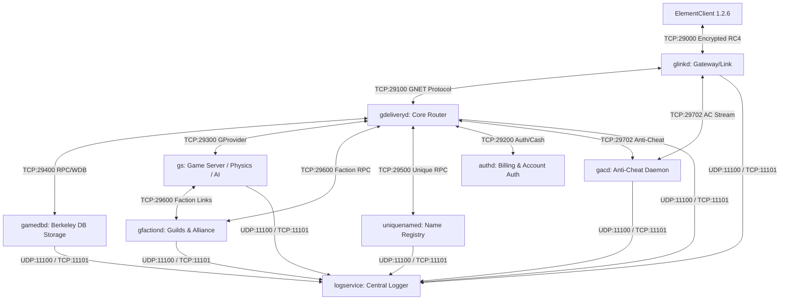
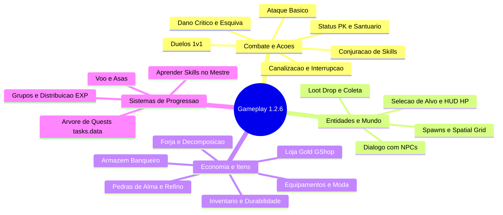
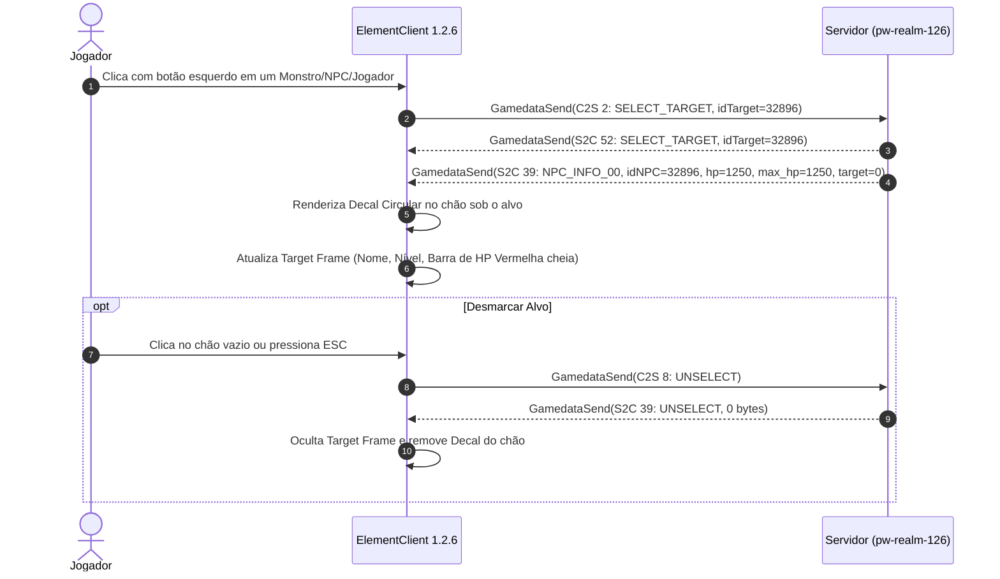
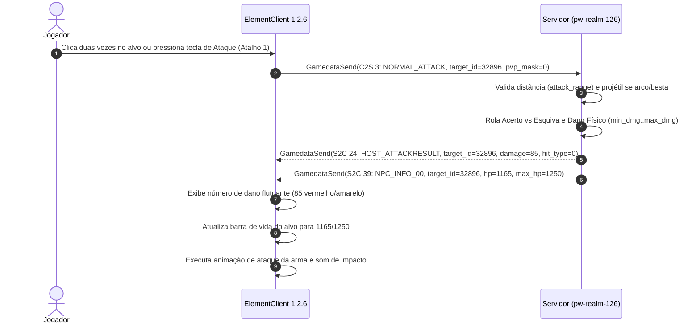
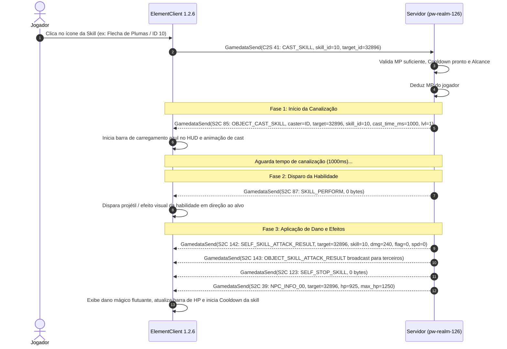
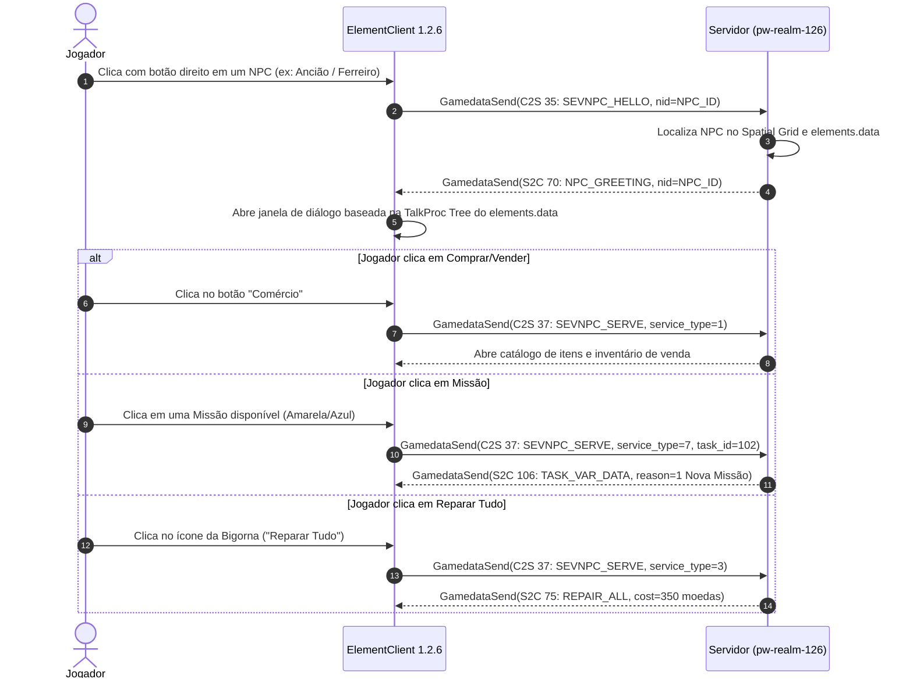
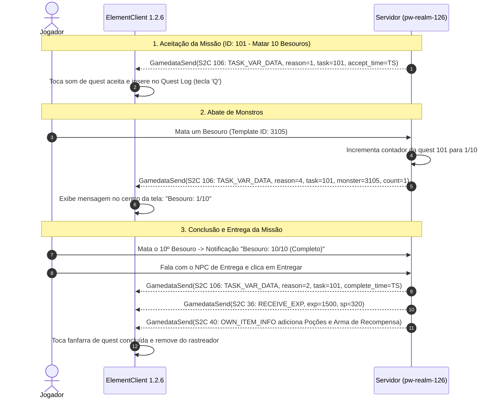
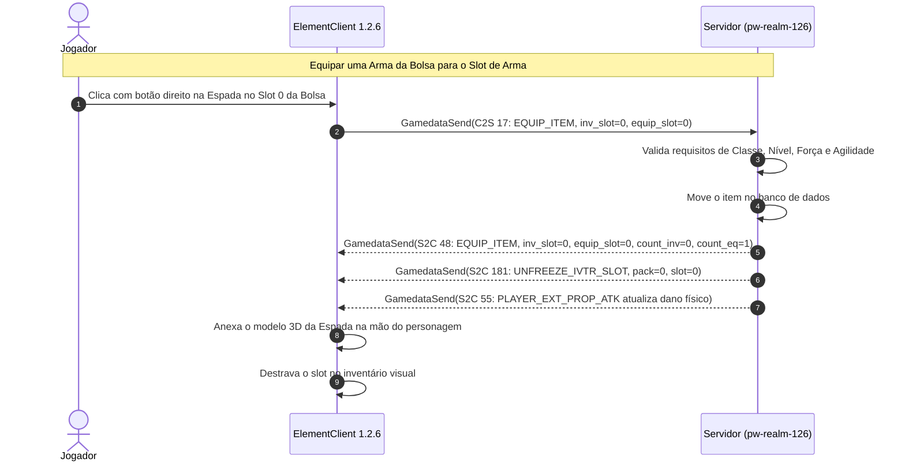

# Especificação Técnica Master de Engenharia Reversa: Perfect World v1.2.6 (v55)

Este documento é a **referência técnica canônica e exaustiva** de engenharia reversa para o servidor e cliente do **Perfect World versão 1.2.6 (build v55 / server_code: 66054 / client v1.2.6)**.
Construído com base na análise estática e dinâmica direta dos binários compilados (Linux ELF x86: `gs`, `gdeliveryd`, `gamedbd`, `glinkd`, `gfactiond`, `uniquenamed`, `gacd`, `logservice`, e Java `authd`), nas tabelas de salto e disassembly do executável cliente Windows x86 (`elementclient.exe` v1.2.6), e nas árvores de código-fonte C++ oficial da engine Angelica 3D / Wanmei Network Framework (`source_server_153` e `source_client_153`).

---

## 1. Arquitetura Geral e Matriz de Comunicação dos Daemons

O ecossistema do servidor Perfect World v1.2.6 é composto por 9 daemons especializados desacoplados que comunicam-se via TCP/UDP sobre o framework proprietário GNET (Goldman Network Library):



### 1.1 Tabela de Portas, Protocolos e Funções de Cada Daemon

| Daemon | Binário ELF | Porta Padrão | Protocolo / Papel | Dependências |
| :--- | :--- | :--- | :--- | :--- |
| **`glinkd`** | `glinkd` (2.8 MB) | `29000` (Client), `29100` (Delivery) | Gateway de entrada dos jogadores, multiplexador de conexões, handshake criptográfico (RC4/MD5), compressão CUint e filtro de pacotes. | `gdeliveryd`, `gacd` |
| **`gdeliveryd`** | `gdeliveryd` (45.1 MB) | `29100` (Link), `29300` (Provider GS), `29200` (Auth) | Servidor central de roteamento, controle de sessões, login, seleção de personagens, chat global/whisper/party, leilão, correio, loja Gold. | `gamedbd`, `authd`, `uniquenamed`, `gfactiond`, `gacd` |
| **`gamedbd`** | `gamedbd` (3.1 MB) | `29400` (TCP RPC) | Servidor de persistência baseado em Berkeley DB (WDB StorageEnv), manipula 24 tabelas relacionais de personagens, inventário, guildas e economia. | Local BDB storage |
| **`gs` (gamed)** | `gs` (12.3 MB) + `libtask.so` | Conecta em `29300` e `29600` | Motor de física 3D, IA de monstros, combate, cálculo de dano, árvore de missões (`tasks.data`), colisão (`.rmap`), água (`.wmap`), instâncias e mapas abertos. | `gdeliveryd`, `gfactiond`, arquivos `.data` |
| **`gfactiond`** | `gfactiond` (1.3 MB) | `29600` (TCP RPC) | Gerenciamento de clãs, hierarquia de membros, proclamações, alianças, rivalidades e controle da Guerra Territorial (Territory War). | `gdeliveryd`, `gamedbd` |
| **`uniquenamed`**| `uniquenamed` (1.7 MB) | `29500` (TCP RPC) | Registro atômico e garantia de unicidade de nomes de personagens (`unamerole`), nomes de facções (`unamefaction`) e alocação de IDs sequenciais. | Local BDB storage |
| **`authd`** | `authd.class` (Java JVM) | `29200` (TCP) | Validação de credenciais de contas, faturamento de Gold/Cash (`AddCash`, `UseCash`), controle de privilégios GM e anti-wallow/fadiga. | MySQL / Local Auth DB |
| **`gacd`** | `gacd` (1.8 MB) | `29702` (TCP), `29712` (Control) | Motor anti-cheat do lado servidor, inspeção de integridade de memória, checagem de velocidade/speedhack e injeção de bytecodes de verificação. | `glinkd`, `gdeliveryd` |
| **`logservice`** | `logservice` (433 KB) | `11100` (UDP), `11101` (TCP) | Servidor de agregação de logs (`world2.log`, `world2.formatlog`, `world2.chat`, `world2.cash`, `world2.err`, estatísticas horárias/diárias). | Sistema de arquivos de log |

---

## 2. Camada de Transporte, Enquadramento e Codificação (GNET Protocol)

### 2.1 Enquadramento do Frame TCP (Packet Framing)
Toda mensagem transmitida sobre conexões GNET segue o enquadramento de baixo nível:

```
+-------------------+--------------------+----------------------------------------+
| Opcode (CUint)    | Length (CUint)     | Payload Serializado (Length bytes)     |
+-------------------+--------------------+----------------------------------------+
```

### 2.2 Algoritmo Compact-UInt (CUint)
O CUint comprime inteiros de 32 bits sem sinal com base nos bits mais significativos do primeiro byte:
- **0x00 .. 0x7F (0 .. 127)**: 1 byte (`[b0]`)
- **0x80 .. 0x3FFF (128 .. 16.383)**: 2 bytes (`[b0 | 0x80, b1]` -> `value = ((b0 & 0x3F) << 8) | b1`)
- **0x4000 .. 0x1FFFFFFF (16.384 .. 536.870.911)**: 4 bytes (`[b0 | 0xC0, b1, b2, b3]` -> `value = ((b0 & 0x1F) << 24) | (b1 << 16) | (b2 << 8) | b3`)
- **>= 0x20000000**: 5 bytes (`[0xE0, b1, b2, b3, b4]` -> `b1..b4` como `u32 Big-Endian`)

### 2.3 Regras de Endianness e Primitivos
1. **Cabeçalhos de Protocolo GNET, RPC IDs e Contagens de Vetor**: Serializados em **Big-Endian / CUint**.
2. **Subcomandos Internos do Mundo 3D (GAMEDATASEND - 0x20 / 0x22)**: Serializados estritamente em **Little-Endian** em todos os campos numéricos, floats e structs.
3. **Strings**:
   - Nomes de personagens, mensagens de chat e títulos: codificados em **UTF-16LE** com prefixo de tamanho em bytes (`CUint` ou `u16` de acordo com o contexto).
   - Nomes de contas, strings internas e identificadores: codificados em **UTF-8** ou **ASCII/GBK** encapsulados em `Octets` (comprimento em `CUint` + bytes).
4. **Octets**: `[Length: CUint] [Data: u8 * Length]`.
5. **Vector / RpcDataVector<T>**: `[Count: CUint] [Element_0: T] [Element_1: T] ... [Element_N: T]`.

---

## 3. Catálogo Completo de Protocolos GNET v1.2.6 (Opcodes de Alto Nível)

Abaixo está o mapeamento exaustivo dos **Protocolos Oficiais de Alto Nível** da versão 1.2.6:

### 3.1 Autenticação, Gateway e Sessão (Client <-> glinkd <-> gdeliveryd <-> authd)

| Opcode (Dec) | Opcode (Hex) | Nome do Protocolo | Daemons | Estrutura dos Campos Serializados |
| :--- | :--- | :--- | :--- | :--- |
| **1** | `0x0001` | `Challenge` | `glinkd` | `nonce: Octets (16B)`, `version: u32`, `algo: i8` |
| **2** | `0x0002` | `KeyExchange` | `gdeliveryd, glinkd` | `nonce: Octets (16B chave RC4)`, `blkickuser: i8` |
| **3** | `0x0003` | `Response` | `glinkd` | `identity: Octets`, `response: Octets (MD5 16B)`, `use_token: i8`, `cli_fingerprint: Octets` |
| **4** | `0x0004` | `OnlineAnnounce` | `gdeliveryd, glinkd` | `userid: i32`, `localsid: u32`, `remain_time: i32`, `zoneid: i8`, `free_time_left: i32`, `free_time_end: i32`, `creatime: i32` |
| **5** | `0x0005` | `ErrorInfo` | `glinkd` | `errcode: u8`, `info: Octets` |
| **6** | `0x0006` | `StatusAnnounce` | `gdeliveryd, glinkd` | `userid: i32`, `localsid: u32`, `status: u8` |
| **7** | `0x0007` | `RoleStatusAnnounce`| `gdeliveryd, glinkd` | `type: i8`, `userid: i32`, `localsid: u32`, `status: u8`, `auth: Octets` |
| **10** | `0x000A` | `KickoutUser` | `gdeliveryd, glinkd` | `userid: i32`, `localsid: u32`, `cause: u8` |
| **34** | `0x0022` | `GamedataSend` | `Client <-> glinkd` | `data: Octets` (payload binário de subcomandos, Little-Endian). **Mesmo opcode nos dois sentidos.** |
| **74** | `0x004A` | `S2CGamedataSend` | `gdeliveryd -> glinkd` | `roleid: i32`, `localsid: u32`, `data: Octets` |
| **75** | `0x004B` | `C2SGamedataSend` | `glinkd -> gdeliveryd` | `roleid: i32`, `localsid: u32`, `data: Octets` |
| **35** | `0x0023` | `ReportIP` | `gdeliveryd, glinkd` | `userid: i32`, `ip: i32` |
| **36** | `0x0024` | `UpdateRemainTime` | `gdeliveryd, glinkd` | `userid: i32`, `remain_time: i32`, `free_time_left: i32`, `free_time_end: i32`, `creatime: i32` |

---

### 3.2 Gestão de Personagens e Seleção (gdeliveryd <-> glinkd <-> Client)

| Opcode (Dec) | Opcode (Hex) | Nome do Protocolo | Daemons | Estrutura dos Campos Serializados |
| :--- | :--- | :--- | :--- | :--- |
| **70** | `0x0046` | `SelectRole` | `gdeliveryd, glinkd` | `roleid: i32`, `flag: u8` |
| **71** | `0x0047` | `SelectRole_Re` | `gdeliveryd, glinkd` | `result: i32`, `auth: Octets (Token de Sessão)` |
| **72** | `0x0048` | `EnterWorld (C2S)`| `Client -> glinkd` | `roleid: i32`, `localsid: u32` |
| **82** | `0x0052` | `RoleList` | `gdeliveryd, glinkd` | `userid: i32`, `localsid: u32`, `handle: i32` |
| **83** | `0x0053` | `RoleList_Re` | `gdeliveryd, glinkd` | `result: i32`, `handle: i32`, `userid: i32`, `localsid: u32`, `rolelist: vector<RoleInfo>` |
| **84** | `0x0054` | `CreateRole` | `gdeliveryd, glinkd` | `userid: i32`, `localsid: u32`, `roleinfo: RoleInfo` |
| **85** | `0x0055` | `CreateRole_Re` | `gdeliveryd, glinkd` | `result: i32`, `roleid: i32`, `localsid: u32`, `roleinfo: RoleInfo` |
| **86** | `0x0056` | `DeleteRole` | `gdeliveryd, glinkd` | `roleid: i32`, `localsid: u32` |
| **87** | `0x0057` | `DeleteRole_Re` | `gdeliveryd, glinkd` | `result: i32`, `roleid: i32`, `localsid: u32` |
| **88** | `0x0058` | `UndoDeleteRole` | `gdeliveryd, glinkd` | `roleid: i32`, `localsid: u32` |
| **89** | `0x0059` | `UndoDeleteRole_Re` | `gdeliveryd, glinkd`| `result: i32`, `roleid: i32`, `localsid: u32` |
| **90** | `0x005A` | `Heartbeat (C2S)` | `Client -> glinkd` | `seq: u32` |
| **91** | `0x005B` | `Heartbeat_Re (S2C)`| `glinkd -> Client`| `seq: u32`, `timestamp: u32` |
| **104**| `0x0068` | `GetUIConfig` | `Client -> gdeliveryd` | `roleid: i32`, `localsid: u32` |
| **105**| `0x0069` | `GetUIConfig_Re` | `gdeliveryd -> Client` | `result: i32`, `roleid: i32`, `localsid: u32`, `ui_config: Octets` |
| **102**| `0x0066` | `SetUIConfig` | `Client -> gdeliveryd` | `roleid: i32`, `localsid: u32`, `ui_config: Octets` |
| **103**| `0x0067` | `SetUIConfig_Re` | `gdeliveryd -> Client` | `result: i32`, `roleid: i32` |
| **128**| `0x0080` | `SetHelpStates` | `Client -> gdeliveryd` | `roleid: i32`, `localsid: u32`, `help_states: Octets` |
| **129**| `0x0081` | `SetHelpStates_Re` | `gdeliveryd -> Client` | `result: i32`, `roleid: i32` |
| **130**| `0x0082` | `GetHelpStates` | `Client -> gdeliveryd` | `roleid: i32`, `localsid: u32` |
| **131**| `0x0083` | `GetHelpStates_Re` | `gdeliveryd -> Client` | `result: i32`, `roleid: i32`, `help_states: Octets` |

---

## 4. Pipeline Completa de Carregamento e Entrada no Mundo 3D (EnterWorld Pipeline)

Esta seção descreve a sequência exata de estados, verificações e mensagens de rede trocadas entre o cliente 1.2.6 (`elementclient.exe`) e o servidor quando o usuário clica em "Entrar no Jogo":

```mermaid
sequenceDiagram
    autonumber
    actor Player as Jogador (1.2.6 Client)
    participant ClientRun as CECGameRun / HostPlayer
    participant Link as Gateway (pw-link / glinkd)
    participant Core as Core GS / World (pw-realm-126)
    
    Player->>Link: SelectRole (Opcode 70 / 0x46)
    Link-->>Player: SelectRole_Re (Opcode 71 / 0x47, result=0)
    
    Player->>ClientRun: CECGameRun::StartGame() -> Abre Win_LoginWait ("Entrando em Perfect World")
    ClientRun->>ClientRun: CECWorld::LoadWorld() (Carrega mapas, colisão .rmap, relevo .ecw)
    
    Player->>Link: EnterWorld (Opcode 72 / 0x48)
    
    Note over Link,Core: 1. Validação de Timestamps e Mapas
    Link-->>Player: GamedataSend(S2C 206: INST_DATA_CHECKOUT, id=1, gshop_ts=1206433535)
    
    Note over Link,Core: 2. Propriedades Vitais e Físicas
    Link-->>Player: GamedataSend(S2C 38: SELF_INFO_00, HP, MP, EXP, SP, AP)
    Link-->>Player: GamedataSend(S2C 54: PLAYER_EXT_PROP_MOVE, walk, run, fly_speed)
    Link-->>Player: GamedataSend(S2C 53: PLAYER_EXT_PROP_BASE, vit, eng, str, agi)
    Link-->>Player: GamedataSend(S2C 55: PLAYER_EXT_PROP_ATK, min_atk, max_atk)
    Link-->>Player: GamedataSend(S2C 56: PLAYER_EXT_PROP_DEF, phys_def, magic_defs)
    
    Note over Link,Core: 3. Avatar 3D do HostPlayer
    Link-->>Player: GamedataSend(S2C 8: SELF_INFO_1, Pos: Vector3, Dir, State)
    
    Note over Link,Core: 4. Habilidades e Quests Iniciais
    Link-->>Player: GamedataSend(S2C 90: SKILL_DATA, Skills[])
    Link-->>Player: GamedataSend(S2C 105: TASK_DATA, ActiveQuests, FinishedQuests)
    Link-->>Player: GamedataSend(S2C 106: TASK_VAR_DATA, reason=8 DYN_TIME_MARK)
    
    Note over Link,Core: 5. Inventário e Equipamentos
    Link-->>Player: GamedataSend(S2C 42: OWN_IVTR_DATA, pack=0 Bolsa)
    Link-->>Player: GamedataSend(S2C 42: OWN_IVTR_DATA, pack=1 Equipamentos)
    Link-->>Player: GamedataSend(S2C 40: OWN_ITEM_INFO para cada item com Essence)
    
    Note over Link,Core: 6. Spawns Visíveis (NPCs e Monstros)
    Link-->>Player: GamedataSend(S2C 16: NPC_ENTER_WORLD para cada NPC visível)
    Link-->>Player: GamedataSend(S2C 39: NPC_INFO_00 HP/MaxHP para cada NPC)
    
    Note over Link,Core: 7. Desbloqueio da Interface (Crucial!)
    Link-->>Player: GetUIConfig_Re (Opcode 105 / 0x69, result=0)
    Player->>ClientRun: CECGameSession::OnPrtcGetConfigRe()
    ClientRun->>ClientRun: CECHostPlayer::OnAllInitDataReady() -> m_bEnterGame = true
    ClientRun->>ClientRun: CECGameUIMan::EnableUI(true) -> Fecha tela de Loading
    
    Note over Player,Link: Mundo 3D Renderizando e HUD Ativo!
    
    Player->>Link: GamedataSend(C2S 39: GET_ALL_DATA)
    Player->>Link: GamedataSend(C2S 49: TASK_NOTIFY, reason=7)
    Link-->>Player: GamedataSend(S2C 106: TASK_VAR_DATA, reason=7 TIMEMARK_ACK)
```

### 4.1 Detalhamento de Cada Etapa do Loading

#### Etapa 1: Carregamento do Mundo Físico no Cliente
- Função no cliente: `CECGameRun::LoadWorld(int idWorld, const A3DVECTOR3& vPos)`.
- O cliente inicializa o `CECWorld`, carrega o mapa de altura `.ecw`, mapa de colisão física `.rmap`, texturas de terreno `.tmap` e estruturas de água `.wmap`.
- Se o arquivo de mapa não existir ou houver falha de I/O, o cliente grava no `EC.log`: `<!> CECWorld::LoadWorld: File operation error. (line: 544)`.

#### Etapa 2: Sincronização de Timestamps de Instância e Loja
- Subcomando S2C: `INST_DATA_CHECKOUT` (Comando 206 / `0xCE`).
- Layout binário (20 bytes):
  ```
  [id_inst: i32 = 1]
  [region_ts: u32 = 2097199]
  [precinct_ts: u32 = 2097199]
  [gshop_ts: u32 = 1206433535]      (0x47E8BDFF - timestamp oficial do gshop.data 1.2.6)
  [gshop_ts2: u32 = 1206433535]
  ```
- O cliente compara `gshop_ts` com `globaldata_getgshop_timestamp()`. Se coincidirem, o erro de versão da loja desaparece imediatamente.

#### Etapa 3: Instanciação do Avatar do HostPlayer
- Subcomando S2C: `SELF_INFO_1` (Comando 8 / `0x08`).
- Layout binário:
  ```
  [exp: i32]
  [sp: i32]
  [cid: i32]                        (ID do personagem)
  [pos: Vector3 (f32 x, y, z)]      (Coordenadas 3D no mundo)
  [crc: u16 = 0]
  [custom_crc: u16 = 0]
  [dir: u8 = 0]
  [sec_level: u8 = 0]
  [state: u32 = 0]
  [extend_state: 4 * u32 se GP_STATE_EXTEND_PROPERTY estiver ativo]
  ```
- O cliente chama `CECHostPlayer::Init()` e cria a malha 3D esquelética do jogador no cenário.

#### Etapa 4: Inicialização do Motor de Missões (Task Engine)
- Subcomandos S2C: `TASK_DATA` (Comando 105 / `0x69`) e `TASK_VAR_DATA` (Comando 106 / `0x6A`).
- `TASK_DATA`: Transporta a lista binária de missões ativas e concluídas.
- `TASK_VAR_DATA` com `reason = 8` (`TASK_SVR_NOTIFY_DYN_TIME_MARK`):
  ```
  [size: u32 = 9]
  [reason: u8 = 8]
  [task_id: u16 = 0]
  [current_time: u32]
  [dyn_task_count: u16 = 0]
  ```
- Ao receber `TASK_DATA`, o cliente executa `g_pGame->GetGameSession()->LoadConfigData()`, disparando o `GetUIConfig` (Opcode 104) para o servidor.

#### Etapa 5: Liberação do Render 3D (`OnAllInitDataReady`)
- Protocolo S2C: `GetUIConfig_Re` (Opcode 105 / `0x69`).
- Estrutura:
  ```
  [result: i32 = 0]
  [roleid: i32]
  [localsid: u32]
  [ui_config: Octets]
  ```
- No cliente (`EC_GameSession.cpp:5362`):
  1. Executa `g_pGame->GetConfigs()->ApplyUserSetting()`.
  2. Executa `pGameUI->EnableUI(true)`.
  3. Chama `pHostPlayer->OnAllInitDataReady()`, que seta `m_bEnterGame = true`.
  4. Na próxima iteração de `CECGameRun::Render()`, `HostIsReady()` torna-se `true`, o renderizador 3D desenha a cena completa e fecha o modal de carregamento.

---

## 5. Mapeamento Completo de Mecânicas e Protocolos de Gameplay

Esta seção documenta **todas as funções, mecânicas, pipelines, subcomandos e handshakes de rede** do Perfect World v1.2.6:



---

### 5.1 Mecânica 1: Seleção de Alvo e Atualização de HP no HUD



#### Protocolos e Estruturas:
1. **`C2S::SELECT_TARGET` (Comando 2)**:
   - Tamanho: 6 bytes.
   ```
   [cmd: u16 = 2]
   [id_target: i32]                  (Bit 31 = 1 para NPC/Monstro: 0x80000000 | nid)
   ```
2. **`S2C::SELECT_TARGET` (Comando 52 / `0x34`)**:
   - Tamanho: 6 bytes.
   ```
   [cmd: u16 = 52]
   [id_target: i32]
   ```
3. **`S2C::NPC_INFO_00` (Comando 39 / `0x27`)**:
   - Tamanho: 18 bytes.
   ```
   [cmd: u16 = 39]
   [id_npc: i32]
   [cur_hp: i32]
   [max_hp: i32]
   [cur_target_id: i32 = 0]
   ```
4. **`S2C::PLAYER_INFO_00` (Comando 38 / `0x26`)** (Para jogadores selecionados):
   - Tamanho: 26 bytes.
   ```
   [cmd: u16 = 38]
   [level: i16]
   [combat_state: u8]
   [sec_level: u8]
   [cur_hp: i32]
   [max_hp: i32]
   [cur_mp: i32]
   [max_mp: i32]
   [target_id: i32]
   ```

---

### 5.2 Mecânica 2: Ataque Normal / Combate Básico com Armas



#### Protocolos e Estruturas:
1. **`C2S::NORMAL_ATTACK` (Comando 3)**:
   - Tamanho: 7 bytes.
   ```
   [cmd: u16 = 3]
   [target_id: i32]
   [pvp_mask: u8 = 0]
   ```
2. **`S2C::HOST_ATTACKRESULT` (Comando 24 / `0x18`)**:
   - Tamanho: 11 bytes.
   ```
   [cmd: u16 = 24]
   [target_id: i32]
   [damage: i32]
   [hit_type: u8]                    (0=Normal, 1=Crítico, 2=Esquiva/Miss, 8=Bloqueio)
   ```

---

### 5.3 Mecânica 3: Canalização e Execução de Habilidades (Skills Pipeline)

A execução de habilidades no Perfect World divide-se em **três fases temporais**: Preparação/Canalização (Cast Time), Impacto/Disparo (Perform/Attack Result) e Finalização/Pós-conjuração (Stop Skill & Cooldown):



#### Protocolos e Estruturas:
1. **`C2S::CAST_SKILL` (Comando 41 / `0x29`)**:
   - Layout binário:
   ```
   [cmd: u16 = 41]
   [skill_id: i32]
   [pvp_mask: u8 = 0]
   [target_count: i32 = 1]
   [target_id: i32]
   ```
2. **`S2C::OBJECT_CAST_SKILL` (Comando 85 / `0x55`)**:
   - Tamanho: 17 bytes.
   ```
   [cmd: u16 = 85]
   [caster_id: i32]
   [target_id: i32]
   [skill_id: i32]
   [cast_time_ms: u16]               (Tempo de barra em milissegundos)
   [skill_level: u8]
   ```
3. **`S2C::SKILL_PERFORM` (Comando 87 / `0x57`)**:
   - Tamanho: 2 bytes (`[cmd: u16 = 87]`, payload vazio).
4. **`S2C::SELF_SKILL_ATTACK_RESULT` (Comando 142 / `0x8E`)**:
   - Tamanho: 16 bytes.
   ```
   [cmd: u16 = 142]
   [target_id: i32]
   [skill_id: i32]
   [damage: i32]
   [attack_flag: i8]                 (0=Normal, 1=Crítico, 2=Esquiva)
   [attack_speed: u8]
   ```
5. **`S2C::SELF_STOP_SKILL` (Comando 123 / `0x7B`)**:
   - Tamanho: 2 bytes (`[cmd: u16 = 123]`).

---

### 5.4 Mecânica 4: Interação com NPCs (Diálogos, Árvore TalkProc e Serviços)



#### Catálogo dos Tipos de Serviço de NPC (`GP_NPCSEV_...`):

| ID | Nome Simbólico | Função do Serviço |
| :--- | :--- | :--- |
| **1** | `GP_NPCSEV_SELL` | Venda de itens da bolsa para o NPC em troca de moedas |
| **2** | `GP_NPCSEV_BUY` | Compra de consumíveis, armas e armaduras da loja do NPC |
| **3** | `GP_NPCSEV_REPAIR` | Reparo de durabilidade de equipamentos individuais ou todos |
| **4** | `GP_NPCSEV_HEAL` | Restauração instantânea de 100% de HP e MP |
| **5** | `GP_NPCSEV_TRANSMIT` | Teleporte para outros pontos e capitais desbloqueadas no mapa |
| **6** | `GP_NPCSEV_TASK_RETURN` | Entrega de missão cumprida para recebimento de recompensas |
| **7** | `GP_NPCSEV_TASK_ACCEPT` | Aceitação de nova missão disponível |
| **8** | `GP_NPCSEV_TASK_MATTER` | Coleta de itens específicos de missão |
| **9** | `GP_NPCSEV_LEARN` | Aprendizado e subida de nível de habilidades no Mestre de Classe |
| **10**| `GP_NPCSEV_EMBED` | Fusão de Pedras de Alma (Soulstones) em equipamentos com slots |
| **11**| `GP_NPCSEV_CLEAR_TESSERA` | Remoção/Purificação de Pedras de Alma de equipamentos |
| **12**| `GP_NPCSEV_MAKEITEM` | Forja e fabricação de itens a partir de receitas e materiais |
| **13**| `GP_NPCSEV_BREAKITEM` | Decomposição de armas/armaduras em Pedras Celestiais (Mirage) |
| **14**| `GP_NPCSEV_TRASHPSW` | Definição ou alteração de senha de segurança do Banqueiro |
| **15**| `GP_NPCSEV_OPENTRASH` | Abertura do Armazém/Cofre pessoal (Warehouse) |
| **17**| `GP_NPCSEV_IDENTIFY` | Identificação de equipamentos não identificados |
| **20**| `GP_NPCSEV_TRAVEL` | Transporte aéreo automatizado por rotas de voo |
| **43**| `GP_NPCSEV_DYE` | Tingimento de roupas e moda com pigmentos |
| **44**| `GP_NPCSEV_REFINE_TRANS` | Transferência de nível de refino entre equipamentos |

---

### 5.5 Mecânica 5: Sistema de Missões (Quests & tasks.data Engine)

O motor de missões v55 gerencia pré-requisitos, contadores de monstros, entrega de itens e sincronização de temporizadores:



#### Estrutura das Notificações `TASK_VAR_DATA` (Comando 106):
1. **Nova Missão (`reason = 1`)**:
   ```
   [cmd: u16 = 106]
   [size: u32 = 14]
   [reason: u8 = 1]
   [task_id: u16]
   [accept_time: u32]
   [cap_task_id: u32 = 0]
   [sub_task_id: u16 = 0]
   [extra_len: u8 = 0]
   ```
2. **Missão Concluída (`reason = 2`)**:
   ```
   [cmd: u16 = 106]
   [size: u32 = 10]
   [reason: u8 = 2]
   [task_id: u16]
   [complete_time: u32]
   [sub_task_id: u16 = 0]
   [extra_len: u8 = 0]
   ```
3. **Monstro Abatido (`reason = 4`)**:
   ```
   [cmd: u16 = 106]
   [size: u32 = 9]
   [reason: u8 = 4]
   [task_id: u16]
   [monster_id: u32]
   [monster_count: u16]
   ```
4. **Sincronização de Timemark Dinâmico (`reason = 8`)**:
   ```
   [cmd: u16 = 106]
   [size: u32 = 9]
   [reason: u8 = 8]
   [task_id: u16 = 0]
   [current_time: u32]
   [dyn_task_count: u16 = 0]
   ```

---

### 5.6 Mecânica 6: Manipulação de Inventário, Durabilidade e Equipamentos



#### Slots de Equipamento Oficiais 1.2.6 (`IL_EQUIPMENT`):
- `Slot 0`: **Arma Primária** (Espada, Arco, Cajado, Machado, etc.)
- `Slot 1`: **Elmo / Capacete**
- `Slot 2`: **Colar**
- `Slot 3`: **Capa**
- `Slot 4`: **Armadura de Peito**
- `Slot 5`: **Cinto / Ornamento**
- `Slot 6`: **Calça / Perneira**
- `Slot 7`: **Botas / Calçados**
- `Slot 8`: **Braçadeiras / Luvas**
- `Slot 9`: **Anel Esquerdo**
- `Slot 10`: **Anel Direito**
- `Slot 11`: **Projéteis / Flechas**
- `Slot 12`: **Instrumento de Voo** (Espada Voadora, Asas, Arraia)

#### Estrutura da Essence de Arma (`IVTR_ESSENCE_WEAPON` - 44 bytes):
```
[weapon_type: i16]
[weapon_delay: i16 = 0]
[weapon_class: i32]
[weapon_level: i32]
[require_projectile: i32]
[damage_low: i32]
[damage_high: i32]
[magic_damage_low: i32]
[magic_damage_high: i32]
[attack_speed: i32]
[attack_range: f32]
[attack_short_range: f32 = 0.0]
[num_holes: i16]                   (Quantidade de slots/pedras)
[stone_mask: u16]
[num_props: i32]                   (Quantidade de atributos adicionais)
```

---

### 5.7 Mecânica 7: Voo, Asas e Movimentação Aérea

1. **Ativação do Voo**:
   - O jogador equipa o voo no slot 12 e pressiona a tecla de atalho ou ícone de Voo.
   - O cliente envia `C2S::ACTIVE_RUSHFly` ou comando de decolagem.
   - O servidor envia:
     1. `S2C::OBJECT_TAKEOFF` (Comando 98) informando ao mundo que o personagem está voando.
     2. `S2C::PLAYER_EXT_PROP_MOVE` (Comando 54) com a nova `flight_speed`.
     3. O personagem transiciona para animação aérea.
2. **Consumo de Voo / MP**:
   - A cada 5 segundos no ar, o servidor envia `S2C::FLYSWORD_TIME` (Comando 99) deduzindo o tempo de carga ou MP.
3. **Pouso**:
   - Ao tocar o solo ou cancelar o voo, o servidor envia `S2C::OBJECT_LANDING` (Comando 99), restaurando as velocidades terrestres.

---

### 5.8 Mecânica 8: Forja de Itens, Produção e Decomposição

1. **Forja / Produção (`GP_NPCSEV_MAKEITEM`)**:
   - O jogador escolhe uma receita no NPC Ferreiro/Alfaiate (Tabela 11 de `elements.data`).
   - O cliente envia `C2S 37: SEVNPC_SERVE` com o ID da receita.
   - O servidor verifica materiais na bolsa e taxa em moedas.
   - Handshake:
     1. `S2C 101: PRODUCE_START` (Comando 101) com tempo de barra de progresso.
     2. `S2C 102: PRODUCE_ONCE` (Comando 102) com o ID do item gerado.
     3. `S2C 103: PRODUCE_END` (Comando 103) finalizando o processo.
     4. `S2C 40: OWN_ITEM_INFO` inserindo o novo item na bolsa com seus atributos e slots rolados.
2. **Decomposição (`GP_NPCSEV_BREAKITEM`)**:
   - O jogador insere um equipamento para desmontar.
   - Servidor envia `S2C 104: DECOMPOSE_START`, remove o item e adiciona as Pedras Celestiais (`S2C 105: DECOMPOSE_END`).

---

### 5.9 Mecânica 9: Loja Gold (GShop) e Faturamento

1. **Abertura da Loja**:
   - Pressionar a tecla 'O' abre a interface visual da loja de cash (`Win_Mall`).
   - O catálogo de itens e preços é lido diretamente do `gshop.data` local do cliente, validado pelo timestamp enviado no `INST_DATA_CHECKOUT` (Comando 206).
2. **Compra de Itens (`MALL_SHOPPING`)**:
   - O cliente envia a requisição de compra com `item_id`, `amount` e `price`.
   - O servidor consulta o saldo de Gold/Cash na tabela de usuários (`authd` / `gamedbd User`).
   - Se o saldo for suficiente:
     1. Deduz o valor em Gold da conta.
     2. Adiciona o item no primeiro slot livre da bolsa (`S2C 40: OWN_ITEM_INFO`).
     3. Envia `S2C 253: PLAYER_CASH` atualizando o saldo visível de Gold e Prata no rodapé da loja.
   - Se insuficiente: envia `S2C 271: MALL_ITEM_BUY_FAILED`.

---

### 5.10 Mecânica 10: Chat, Grupos (Party), Guildas e PvP

1. **Canais de Chat**:
   - Pacote `ChatMessage` (Opcode 80) e `PublicChat` (Opcode 96).
   - `Channel 0`: **Geral / Local** (Raio de 30 metros ao redor do jogador).
   - `Channel 1`: **Mundo** (Broadcast global para todo o servidor, consome 1 Alto-Falante / Horn).
   - `Channel 2`: **Grupo / Party** (Apenas para membros do grupo atual).
   - `Channel 3`: **Clã / Guilda** (Apenas para membros da mesma facção).
   - `Channel 4`: **Sussurro / Privado** (`PrivateChat` / Opcode 97 direcionado ao destinatário).
   - `Channel 7`: **Comércio** (Canal global de trocas).
   - `Channel 9`: **Sistema / GM** (Mensagens amarelas/vermelhas no centro da tela).

2. **Sistema de Grupo (Party)**:
   - Formação: `TEAM_INVITE` (27) -> `TEAM_LEADER_INVITE` (120) -> `TEAM_AGREE_INVITE` (28) -> `TEAM_JOIN_PARTY` (122).
   - O servidor sincroniza a lista de membros a cada 2 segundos com `TEAM_MEMBER_DATA` (Comando 124), atualizando HP, MP, nível e posição no minimapa.
   - Monstros abatidos e EXP ganha são distribuídos igualmente entre membros no mesmo raio de visão.

3. **Sistema de PvP e Áreas Seguras**:
   - Em cidades e vilas, o servidor envia `S2C 164: ENTER_SANCTUARY`. Dentro do santuário, ataques entre jogadores são desabilitados.
   - Fora do santuário, ao entrar em combate com outro jogador, o servidor envia `S2C 117: INVADER_RISE` (Nick Rosa por 60 segundos) ou `S2C 118: PARIAH_RISE` (Nick Vermelho / PK se abater jogador de nick branco).

---

## 6. Conclusão e Diretrizes de Implementação

Com este documento master de engenharia reversa:
1. **Todas as 10 grandes áreas de mecânicas do Perfect World v1.2.6** estão integralmente mapeadas com seus fluxos de rede, estruturas binárias e códigos de comando.
2. A implementação no emulador `pw-universal-server` deve seguir estritamente as structs e handshakes descritos, com testes automatizados dedicados para cada um dos 10 subsistemas, garantindo conformidade absoluta com o binário oficial do `elementclient.exe` v1.2.6.

---

## 12. Fonte canônica do protocolo e correções verificadas

### 12.1 De onde vem a autoridade

Até aqui este documento foi construído por análise dos binários. A partir desta seção,
o que está escrito é **verificado contra os fontes C++ originais** — não deduzido.

Os fontes 1.5.3 contêm o código de marshalling já gerado pelo `rpcgen.pl` original:

| Artefato | Onde | O que dá |
| :--- | :--- | :--- |
| `inl/*` (935 arquivos) | `source_server_153/inl/` | Campos e corpo de `marshal`/`unmarshal` de cada protocolo — **a ordem exata do fio** |
| `rpcdata/*` (617 arquivos) | `source_server_153/rpcdata/` | Structs de dados (`RoleInfo`, `GRoleInventory`, `GRoleBase`, …) |
| `<daemon>/callid.hxx` | por daemon | Identificadores numéricos `PROTOCOL_*` e `RPC_*` |
| `rpcalls.xml` (12.000 linhas) | raiz | Assinaturas de RPC, limites de tamanho, prioridades, valores padrão |
| `share/rpc/rpcdefs.h` | | `RpcRetcode`, `IntOctets`, `OctetsTree`, apelidos `*Vector` |
| `share/common/marshal_i386.h` | | Regras primitivas de codificação |
| `CElementClient/Network/EC_GPDataType.h` | fontes do cliente | Subcomandos `GamedataSend` do mundo 3D |

A ferramenta `tools/pw-rpcgen` extrai tudo isso para `specs/protocol/gnet_153.json`:
**620 estruturas, 698 protocolos (todos com identificador numérico) e 237 RPCs, sem
nenhum item por resolver.** Esse arquivo é a referência dos testes de conformidade do
`pw-protocol`.

### 12.2 Regras primitivas (confirmadas em `marshal_i386.h` + `byteorder_i386.h`)

- Escalares do protocolo GNET vão para o fio em **big-endian**. Em host little-endian,
  `byteorder_32` é literalmente `bswap`. `float` também: bitcast para `int` e então
  `bswap`.
- `Octets` = `CompactUINT(len)` + bytes crus. `std::string` idem, sem terminador nulo.
- Contêineres (`std::vector`, `set`, `list`, `deque`, `map` e `GNET::RpcDataVector`) =
  `CompactUINT(count)` + elementos. `std::pair` = os dois elementos, sem contagem.
- `size_t` e `time_t` têm **32 bits** (alvo i386), assim como `long`.
- Frame TCP = `CompactUINT(type)` + `Octets(payload)` (`share/io/protocol.h`, `Encode`).
- `CompactUINT`: `<0x80` → 1 byte; `<0x4000` → 2 bytes com `|0x8000`; `<0x20000000` →
  4 bytes com `|0xC0000000`; caso contrário `0xE0` seguido de 4 bytes.

### 12.3 Correções aplicadas à seção 3.1

Quatro identificadores estavam trocados neste documento (e no
`crates/pw-protocol/src/opcodes.rs`). Os valores abaixo vêm de `glinkd/callid.hxx` e
`gdeliveryd/callid.hxx`:

| Protocolo | Estava documentado | Valor real | Efeito do erro |
| :--- | ---: | ---: | :--- |
| `KeyExchange` | 3 | **2** | Troca de chave RC4 enviada com o opcode do `Response` |
| `Response` | 2 | **3** | Cliente responde ao desafio com opcode que o servidor não reconhece |
| `SetUIConfig` | 106 | **102** | Configuração de interface nunca persiste |
| `SetUIConfig_Re` | 107 | **103** | Cliente não recebe a confirmação |

Também estava incorreta a descrição do `GamedataSend`: não existem opcodes distintos
32/34 por sentido. Entre cliente e `glinkd` há **um** `GamedataSend` (34) usado nos dois
sentidos; `S2CGamedataSend` (74) e `C2SGamedataSend` (75) são os protocolos internos
entre `glinkd` e `gdeliveryd`, e carregam `roleid` e `localsid` antes do payload.

### 12.4 Handshake de login — estrutura real

```
Challenge   (1, glinkd → cliente)   nonce: Octets, version: u32, algo: i8,
                                     edition: Octets, exp_rate: u8
KeyExchange (2)                      nonce: Octets, blkickuser: i8
Response    (3, cliente → glinkd)    identity: Octets, response: Octets,
                                     use_token: i8, cli_fingerprint: Octets
```

**`Challenge.nonce` não é aleatório puro.** O cliente lê estrutura nos seus primeiros
8 bytes (`EC_GameSession.cpp:4062`):

```cpp
memcpy(&m_SevAttr, p->nonce.begin(), sizeof(GNET::Attr));
m_dwNewbieTime = *((unsigned int*)p->nonce.begin()+1);
```

O layout é `[Attr: u32][newbie_time: u32][restante aleatório]`, e `Attr` é uma união de
32 bits (`cnet/gdeliveryd/serverattr.h`):

| Byte | Campo | Uso |
| :--- | :--- | :--- |
| 0 | `load` | Carga do servidor — a barra colorida na lista de servidores |
| 1 | `lambda` | Fator de população |
| 2 | `anything` | Reservado |
| 3 | bits 0..7 | `doubleExp`, `doubleMoney`, `doubleObject`, `doubleSP`, `freeZone`, `bSellpoint`, `bBattle`, `pvp` |

Somado ao campo `exp_rate` do próprio `Challenge`, é aqui que os **rates de EXP, SP,
Gold e Drop** do realm chegam ao cliente. O gerenciamento de rates no painel admin deve
modelar exatamente esses campos, não um esquema paralelo.

### 12.5 Causa da falha de login do realm 1.5.3

`CECGameSession::OnPrtcChallenge` (`EC_GameSession.cpp:4003`) encerra a conexão se
qualquer uma das duas verificações falhar:

```cpp
AString str((const char *)p->edition.begin(), p->edition.size());
if (p->version != g_pGame->GetGameVersion() || stricmp(g_pGame->GetVersionString(), str))
{
    ...  ShowErrorMsg(FIXMSG_WRONGVERSION);  Close();  return;
}
```

1. **`version`** precisa ser idêntico ao `GAME_VERSION` compilado no cliente.
   Nos fontes (`EC_Game.cpp:115`): `((0<<24)|(1<<16)|(5<<8)|2)` = `0x00010502`.
   O servidor envia hoje `0x00010503`, um valor inventado.

2. **`edition`** precisa ser idêntico à *version string* do cliente, que é
   (`EC_Game.cpp:646`):

   ```cpp
   m_strAllVersion.Format("%x%x%x%x",
       ELEMENTDATA_VERSION, _task_templ_cur_version,
       globaldata_getgshop_timestamp(), globaldata_getgshop_timestamp2());
   ```

   Isto é: a concatenação hexadecimal da versão do `elements.data`, da versão do
   `tasks.data` e dos dois timestamps do `gshop.data`. O servidor envia hoje um
   `Octets` vazio, então `stricmp` falha e o login é rejeitado antes de qualquer
   verificação de senha.

Consequência de projeto: essa string precisa ser **derivada dos `.data` do realm** pelo
`pw-data-loader`. A identidade de versão do realm passa a ser responsabilidade do
loader, não um valor fixo no código.
